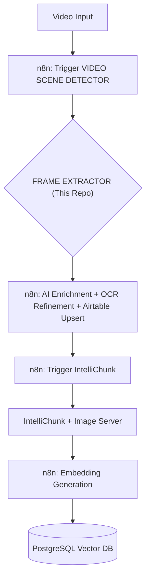
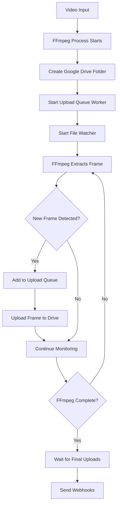

# Video Scene Detector

A powerful FastAPI-based service using FFmpeg to detect scene changes in videos, extract key frames, and upload them to Google Drive. Designed as a crucial first step in RAG ingestion pipelines, it integrates seamlessly with n8n workflows via robust webhook notifications.

## Workflow Context

This Video Scene Detector service initiates the content processing pipeline for RAG systems, primarily handling video input. Here's the overall flow, heavily orchestrated by n8n:



**Role in Pipeline:**

1.  An external trigger (e.g., new video upload) starts an n8n workflow.
2.  The n8n workflow calls the `/api/v1/process-drive-video` or `/api/v1/process-video` endpoint of this `VideoSceneDetector` service.
3.  This service processes the video, detects scenes, extracts relevant frames, and uploads them to a designated Google Drive folder.
4.  Upon completion, it sends two webhooks (Frame Analysis and Frame Processor) back to n8n.
5.  The `Frame Processor Webhook` triggers the next n8n workflow segment, which handles AI enrichment, OCR, Airtable updates, and eventually calls the [IntelliChunk](https://github.com/jaywalked78/IntelliChunk) service for semantic chunking and the [Image Server](https://github.com/jaywalked78/Lightweight-File-Hosting-Server) for hosting.

## Features

- **Scene Detection:** Uses FFmpeg `select` filter with `scenedetect` option for accurate scene change identification.
- **Frame Extraction:** Extracts high-quality frames precisely at detected scene change points.
- **Real-time Streaming Upload:** Revolutionary streaming upload system that uploads frames to Google Drive concurrently with FFmpeg extraction, virtually eliminating upload wait time.
- **Dual Google Drive Account Support:** Configurable primary and secondary Google Drive accounts for uploads and downloads, useful for storage space management.
- **Google Drive Integration:** Securely uploads extracted frames to specified Google Drive folders using Service Account or OAuth authentication.
- **Dual Webhook System:** Provides immediate detailed analysis data and a delayed trigger for subsequent processing steps.
- **Gradio Integration:** Optional web interface for testing and manual video processing.
- **Configurable:** Fine-tune scene detection threshold, destination folders, webhook URLs, and authentication via `.env` file.
- **Processing Queue:** Manages video processing tasks sequentially to ensure stability.

## Streaming Upload System

### Overview

The Video Scene Detector features an advanced **real-time streaming upload system** that uploads video frames to Google Drive as they're being extracted by FFmpeg, virtually eliminating upload wait time by processing uploads concurrently with frame extraction.

### How It Works



### Key Components

#### 1. **FrameWatcher** (`app/utils/frame_watcher.py`)
- Monitors the output directory for new frame files
- Detects when files are fully written and stable
- Supports batch detection for multiple frames created simultaneously
- Configurable polling interval (default: 0.2 seconds)

#### 2. **UploadQueueManager** (`app/utils/upload_queue.py`)
- Thread-safe queue system for managing upload tasks
- Sequential upload processing to respect Google Drive API rate limits
- Automatic retry logic with exponential backoff
- Real-time statistics and progress tracking
- Graceful error handling and recovery

#### 3. **Streaming Extraction** (`VideoProcessor.extract_frames_with_streaming_upload`)
- Non-blocking FFmpeg process execution using `subprocess.Popen`
- Real-time monitoring of frame extraction progress
- Integrated upload queue and file watcher management
- Comprehensive logging and error reporting

### Performance Benefits

The streaming upload system eliminates the traditional upload bottleneck:

| Method | FFmpeg Processing | Upload Time | Total Time | Description |
|--------|------------------|-------------|------------|-------------|
| **Traditional Sequential** | 5-10 minutes | 5-20 minutes | **10-30 minutes** | Extract all frames → Wait → Upload all frames |
| **Streaming Upload** | 5-10 minutes | ~0 minutes* | **5-10 minutes** | Extract + Upload simultaneously |

**\*Upload time is virtually eliminated** because uploads happen concurrently with extraction. Once the final frame is extracted, only a few remaining queued frames need to finish uploading.

### Concurrent Processing Workflow

**Traditional Approach:**
```
FFmpeg Extraction: [████████████████████████████████████] 10 minutes
Upload Wait:       [████████████████████████████████████] 15 minutes
Total Time:        25 minutes
```

**Streaming Upload Approach:**
```
FFmpeg Extraction: [████████████████████████████████████] 10 minutes
Concurrent Upload:  [████████████████████████████████████] 
Queue Cleanup:                                          [█] 30 seconds
Total Time:        ~10 minutes
```

The key innovation is that **frame uploads begin immediately** as FFmpeg extracts each frame, rather than waiting for all extraction to complete. This transforms upload time from an additional sequential step into a concurrent background process.

### Example Log Output

```
INFO: Starting streaming extraction and upload with scene_threshold=0.369
INFO: Creating Google Drive folder: screen_recording_2025_06_20_at_5_47_19_am
INFO: Created folder with ID: 1EAVoN3jTfXJsd6JoAXOo2o4xkOPYPRQK
INFO: Upload queue worker started
INFO: Frame watcher started for pattern: frame_*.jpg
INFO: Starting FFmpeg process: ffmpeg -i video.mov -vf select='gt(scene,0.369)',showinfo -vsync 0 frame_%06d.jpg
INFO: New frame detected: frame_000001.jpg, adding to upload queue
INFO: Progress: 1 frames extracted, 0 uploaded, 1 in queue
INFO: Progress: 2 frames extracted, 1 uploaded, 1 in queue
INFO: New frame detected: frame_000002.jpg, adding to upload queue
INFO: Found batch of 3 new frames
INFO: Upload Queue Status - Queued: 10, Uploaded: 7, Failed: 0, In Queue: 3, Rate: 2.1 frames/sec
INFO: FFmpeg processing completed, waiting for all uploads to finish
INFO: STREAMING UPLOAD COMPLETE - Total frames: 283, Uploaded: 283, Failed: 0
```

### Configuration Options

The streaming system is enabled by default and requires no additional configuration. However, you can fine-tune performance:

```python
# In video_processor.py - FrameWatcher configuration
frame_watcher = FrameWatcher(
    output_dir, 
    on_new_frame, 
    poll_interval=0.2  # Check for new files every 200ms
)

# UploadQueueManager configuration  
upload_queue = UploadQueueManager(
    drive_service, 
    folder_id,
    max_retries=3  # Retry failed uploads up to 3 times
)
```

### Error Handling

The streaming system includes robust error handling:

- **FFmpeg Errors**: No webhooks sent for processing failures
- **Upload Failures**: Automatic retry with exponential backoff
- **Rate Limiting**: Intelligent handling of Google Drive API limits
- **File System Errors**: Graceful recovery and reporting

### Monitoring and Debugging

Real-time progress monitoring includes:
- Frame extraction count
- Successful uploads count  
- Queue size and processing rate
- Failed upload tracking
- Estimated completion time

## Setup and Installation

### Prerequisites

- Python 3.8+
- FFmpeg installed and accessible in system PATH (`ffmpeg -version`)
- A Google Cloud project with the Drive API enabled

### Installation Steps

1. Clone the repository:
   ```bash
   git clone https://github.com/jaywalked78/VideoSceneDetector.git
   cd VideoSceneDetector
   ```

2. Create and activate a virtual environment:
   ```bash
   python -m venv venv
   source venv/bin/activate  # On Windows: venv\Scripts\activate
   ```

3. Install dependencies:
   ```bash
   pip install -r requirements.txt
   ```

4. Set up Google Drive Authentication (See [Google Drive Authentication](#google-drive-authentication) section below):
   - Obtain `credentials.json` (OAuth) or a service account JSON key file.
   - Place the file(s) appropriately.
   - Run `python authenticate_drive.py` if using OAuth for the first time.
   - Configure `.env` file (`GOOGLE_DRIVE_SERVICE_ACCOUNT_FILE`, `GOOGLE_DRIVE_USE_SERVICE_ACCOUNT`).

## Configuration

Create a `.env` file in the project root (copy from `.env.example`). Key settings:

```env
# API Configuration
API_VERSION=1.0.0
DEBUG_MODE=false # Set to true for more verbose logging

# Feature Flags
ENABLE_GRADIO=true

# Google Drive Download Configuration (Secondary Account - Service Account)
GOOGLE_DOWNLOAD_USE_SERVICE_ACCOUNT=true
GOOGLE_DOWNLOAD_SERVICE_ACCOUNT_FILE=~/Documents/DatabaseAdvancedTokenizer/VideoSceneDetector/serviceAccountAuth/download_credentials.json
# GOOGLE_DOWNLOAD_CREDENTIALS=~/Documents/DatabaseAdvancedTokenizer/VideoSceneDetector/serviceAccountAuth/secondary-account.json  # OAuth - DISABLED

# Google Drive Upload Configuration (Primary Account - Service Account) 
GOOGLE_UPLOAD_USE_SERVICE_ACCOUNT=true
GOOGLE_UPLOAD_SERVICE_ACCOUNT_FILE=~/Documents/DatabaseAdvancedTokenizer/VideoSceneDetector/serviceAccountAuth/abstract-stage-452423-e5-04c184172a74.json
# GOOGLE_UPLOAD_CREDENTIALS=credentials.json  # OAuth - DISABLED

# Legacy Google Drive Configuration (Fallback)
GOOGLE_DRIVE_USE_SERVICE_ACCOUNT=true
GOOGLE_DRIVE_SERVICE_ACCOUNT_FILE=~/Documents/DatabaseAdvancedTokenizer/VideoSceneDetector/serviceAccountAuth/abstract-stage-452423-e5-04c184172a74.json
# GOOGLE_CREDENTIALS=credentials.json  # OAuth - DISABLED

# Gradio Integration
GRADIO_URL=http://localhost:7860
REQUEST_TIMEOUT=300
MAX_RETRIES=3

# Default Paths
DEFAULT_DOWNLOAD_FOLDER=/home/jason/Downloads
DEFAULT_DESTINATION_FOLDER=/home/videos/screenRecordings

# Webhook Configuration
DEFAULT_CALLBACK_URL=http://localhost:5678/webhook/9268d2b1-e4de-421e-9685-4c5aa5e79289
FRAME_ANALYSIS_WEBHOOK_URL=http://localhost:5678/webhook/9268d2b1-e4de-421e-9685-4c5aa5e79289
FRAME_PROCESSOR_WEBHOOK_URL=http://localhost:5678/webhook/c9af1341-63b6-43fa-a5fc-c7fefc6ab732

# Optional: For background video file deletion
DEFAULT_DELETE_AFTER_PROCESSING=false

# FFmpeg Configuration  
SCENE_THRESHOLD=0.4

# Performance Settings
MAX_CONCURRENT_DOWNLOADS=3

# Default Paths (can be overridden in API calls)
DEFAULT_OUTPUT_DIR=./downloads
WEBHOOK_URL=http://localhost:3001/webhook/video-processing

# Google Drive Configuration
GOOGLE_DRIVE_PARENT_FOLDER_ID=1ogD8Ca0a0kfV5tx_eMYtBS856ICn9qtp

# Frame Watcher Configuration
FRAME_WATCHER_POLL_INTERVAL=0.5
FRAME_WATCHER_STABILITY_TIME=0.2

# Processing Configuration
FFMPEG_STALL_TIMEOUT=1200
WEBHOOK_DELAY_MIN=15
WEBHOOK_DELAY_PER_FRAME=0.75
WEBHOOK_DELAY_MAX=300
```

### Configuration Reference

#### Core Settings
- **`API_VERSION`**: Version number for the API (affects health endpoint response)
- **`DEBUG_MODE`**: Enable verbose logging for troubleshooting (`true`/`false`)
- **`ENABLE_GRADIO`**: Enable optional Gradio web interface (`true`/`false`)

#### Google Drive Authentication
The system supports dual Google accounts for separation of concerns:

- **Primary Account (Upload)**: Used for uploading processed frames
  - `GOOGLE_UPLOAD_USE_SERVICE_ACCOUNT`: Enable service account auth
  - `GOOGLE_UPLOAD_SERVICE_ACCOUNT_FILE`: Path to service account JSON
  - `GOOGLE_UPLOAD_CREDENTIALS`: OAuth credentials file (if not using service account)

- **Secondary Account (Download)**: Used for downloading source videos
  - `GOOGLE_DOWNLOAD_USE_SERVICE_ACCOUNT`: Enable service account auth
  - `GOOGLE_DOWNLOAD_SERVICE_ACCOUNT_FILE`: Path to service account JSON
  - `GOOGLE_DOWNLOAD_CREDENTIALS`: OAuth credentials file (if not using service account)

- **Legacy Fallback**: Backward compatibility settings
  - `GOOGLE_DRIVE_USE_SERVICE_ACCOUNT`: Fallback service account setting
  - `GOOGLE_DRIVE_SERVICE_ACCOUNT_FILE`: Fallback service account file
  - `GOOGLE_CREDENTIALS`: Fallback OAuth credentials

#### Processing Configuration
- **`SCENE_THRESHOLD`**: FFmpeg scene detection sensitivity (0.0-1.0, lower = more scenes)
- **`FFMPEG_STALL_TIMEOUT`**: Maximum seconds to wait for FFmpeg before timing out
- **`GOOGLE_DRIVE_PARENT_FOLDER_ID`**: Default parent folder for Google Drive uploads

#### Performance Tuning
- **`REQUEST_TIMEOUT`**: HTTP request timeout in seconds for webhooks
- **`MAX_RETRIES`**: Maximum retry attempts for failed operations
- **`MAX_CONCURRENT_DOWNLOADS`**: Limit concurrent download operations
- **`FRAME_WATCHER_POLL_INTERVAL`**: How often to check for new frame files (seconds)
- **`FRAME_WATCHER_STABILITY_TIME`**: Time to wait before considering a file stable (seconds)

#### Webhook Timing
- **`WEBHOOK_DELAY_MIN`**: Minimum delay before sending frame processor webhook (seconds)
- **`WEBHOOK_DELAY_PER_FRAME`**: Additional delay per frame processed (seconds)
- **`WEBHOOK_DELAY_MAX`**: Maximum total delay before sending webhook (seconds)

#### Default Paths
- **`DEFAULT_DOWNLOAD_FOLDER`**: Local directory for downloaded videos
- **`DEFAULT_DESTINATION_FOLDER`**: Local directory for extracted frames
- **`DEFAULT_OUTPUT_DIR`**: General output directory
- **`DEFAULT_DELETE_AFTER_PROCESSING`**: Auto-delete source videos after processing

#### Webhook URLs
- **`DEFAULT_CALLBACK_URL`**: Default webhook for API responses
- **`FRAME_ANALYSIS_WEBHOOK_URL`**: Immediate webhook with processing data (for Airtable)
- **`FRAME_PROCESSOR_WEBHOOK_URL`**: Delayed webhook to trigger next pipeline stage
- **`WEBHOOK_URL`**: Additional webhook endpoint

## Running the Server

Use the provided script for robust execution with logging:

```bash
./run_server_with_logs.sh
```

This script handles PID management and log rotation. The server will be available at `http://localhost:8000` (or as configured).

To run directly for development:
```bash
python -m app.main
```

## API Endpoints

### Process a video from Google Drive (Recommended)

```
POST /api/v1/process-drive-video
```
Handles downloading from Google Drive, processing, and uploading frames back to Drive.

**Request Body:**
```json
{
  "file_id": "google-drive-file-id", // Required: Google Drive file ID
  "file_name": "video.mp4", // Optional: If not provided, will be retrieved from Google Drive
  "destination_folder": "NameOfOutputFolderInDrive", // GDrive folder name (uses DEFAULT_DESTINATION_FOLDER if not specified)
  "callback_url": "http://optional-custom-webhook.com", // Optional: Webhook URL (uses DEFAULT_CALLBACK_URL if not specified)
  "scene_threshold": 0.4, // Optional: Scene detection sensitivity 0.0-1.0, lower = more scenes (uses SCENE_THRESHOLD env var if not specified)
  "create_subfolder": true, // Optional: Create a subfolder within destination_folder named after the video (default: true)
  "delete_after_processing": false, // Optional: Delete the downloaded video file locally after processing (default: false)
  "force_download": false, // Optional: Re-download even if file exists locally (default: false)
  "download_account_type": "secondary" // Optional: Which account to use for downloads: "primary" or "secondary" (default: "secondary")
}
```

### Process a video already on the server

```
POST /api/v1/process-video
```
Processes a video file already present on the server's local filesystem.

**Request Body:**
```json
{
  "filename": "video.mp4", // Required: Name of the video file
  "download_folder": "/path/to/local/video/directory", // Optional: Where the video file is located (uses DEFAULT_DOWNLOAD_FOLDER if not specified)
  "destination_folder": "NameOfOutputFolderInDrive", // Optional: Local folder for frame output (uses DEFAULT_DESTINATION_FOLDER if not specified)
  "callback_url": "http://optional-custom-webhook.com", // Optional: Webhook URL (uses DEFAULT_CALLBACK_URL if not specified)
  "scene_threshold": 0.4 // Optional: Scene detection sensitivity (uses SCENE_THRESHOLD env var if not specified)
}
```

### Health Check

```
GET /api/v1/health
```
Returns the status of the server.

## Webhook System

 crucial for integrating with n8n or other automation tools.

1.  **Frame Analysis Webhook** (`FRAME_ANALYSIS_WEBHOOK_URL`):
    *   Sent immediately after local processing and frame extraction completes.
    *   Contains detailed metadata about the video, scenes detected, and extracted frame information (before GDrive upload).
    *   Ideal for logging, analysis, or initial data recording (e.g., in Airtable).
2.  **Frame Processor Webhook** (`FRAME_PROCESSOR_WEBHOOK_URL`):
    *   Sent after a dynamic delay (based on frame count, default 0.75s/frame) *after* frames are successfully uploaded to Google Drive.
    *   Contains the Google Drive folder ID and URL where frames were uploaded.
    *   Specifically designed to trigger the *next* stage of processing in n8n (AI enrichment, OCR, chunking via IntelliChunk).
3.  **Custom Callback URL** (Optional, provided in API request):
    *   Receives the same payload as the Frame Analysis Webhook.
    *   Allows for flexible, per-request integration points.

### Webhook Payloads
*(See original README section for detailed payload examples)*

## Google Drive Authentication

Supports **Service Account** (recommended for server environments) and **OAuth** (requires initial browser interaction). The system now supports dual account configuration for primary and secondary Google accounts.

### Dual Account Setup

1. **Primary Account (Uploads):**
   - Used for uploading processed frames
   - Set `GOOGLE_UPLOAD_SERVICE_ACCOUNT_FILE` and `GOOGLE_UPLOAD_USE_SERVICE_ACCOUNT=true`
   - Or use `GOOGLE_UPLOAD_CREDENTIALS` for OAuth

2. **Secondary Account (Downloads):**
   - Used for downloading source videos (useful when primary account is low on storage)
   - Set `GOOGLE_DOWNLOAD_SERVICE_ACCOUNT_FILE` and `GOOGLE_DOWNLOAD_USE_SERVICE_ACCOUNT=true`
   - Or use `GOOGLE_DOWNLOAD_CREDENTIALS` for OAuth

### Service Account Setup
1. Create service account in Google Cloud Console, enable Drive API, download JSON key
2. Configure appropriate environment variables in `.env`
3. Set corresponding `USE_SERVICE_ACCOUNT=true` variables

### OAuth Setup
1. Get `credentials.json` from Google Cloud Console (OAuth 2.0 Client ID)
2. Place credential files in the project root
3. Run `python authenticate_drive.py` once interactively to generate token files
4. Configure appropriate credential paths in `.env`

**Authentication Priority:** Service Account (env path) -> OAuth Token -> Legacy credentials -> OAuth Flow

**Note:** You can choose which account to download from using the `download_account_type` parameter: "primary" or "secondary" (default: "secondary")

## Troubleshooting

### Common Configuration Issues

#### Environment Variables Not Loading
- Ensure `.env` file is in the project root directory
- Check that environment variable names are spelled correctly
- Verify no extra spaces around `=` signs in `.env` file
- Use `DEBUG_MODE=true` to see detailed logging

#### Google Drive Authentication Issues
- **Service Account**: Ensure the service account JSON file path is correct and accessible
- **OAuth**: Run `python authenticate_drive.py` to generate initial token files
- **Dual Accounts**: Verify both upload and download credentials are configured properly
- **File Permissions**: Check that the service account has access to the specified parent folder ID

#### Performance Issues
- **Slow Processing**: Increase `REQUEST_TIMEOUT` if webhook requests are timing out
- **Memory Issues**: Reduce `MAX_CONCURRENT_DOWNLOADS` or `FRAME_WATCHER_POLL_INTERVAL`
- **Network Issues**: Increase `MAX_RETRIES` for unstable connections

#### FFmpeg Related Issues
- **Scene Detection**: Adjust `SCENE_THRESHOLD` (lower values = more scenes detected)
- **Stalled Processing**: Reduce `FFMPEG_STALL_TIMEOUT` to fail faster on problematic videos
- **Large Videos**: Increase `FFMPEG_STALL_TIMEOUT` for very large video files

#### Webhook Issues
- **Timing Problems**: Adjust `WEBHOOK_DELAY_MIN`, `WEBHOOK_DELAY_PER_FRAME`, and `WEBHOOK_DELAY_MAX`
- **Timeout Errors**: Increase `REQUEST_TIMEOUT` for slow webhook endpoints
- **Duplicate Webhooks**: Check that webhook URLs are correctly configured

### Environment Variable Quick Reference

**Most Important Variables to Check:**
- `GOOGLE_UPLOAD_SERVICE_ACCOUNT_FILE` - Primary account for uploads
- `GOOGLE_DOWNLOAD_SERVICE_ACCOUNT_FILE` - Secondary account for downloads  
- `SCENE_THRESHOLD` - Controls scene detection sensitivity
- `REQUEST_TIMEOUT` - Webhook timeout duration
- `GOOGLE_DRIVE_PARENT_FOLDER_ID` - Default upload destination

**Debug Commands:**
```bash
# Check service availability
python testScripts/test_api_flow.py

# Verify account mapping
python testScripts/verify_account_mapping.py

# Debug credentials
python testScripts/debug_credentials.py

# Test flexible accounts
python testScripts/test_flexible_accounts.py
```

## License

MIT

# Project Dependencies
*(See original README section for Dependencies)* 
